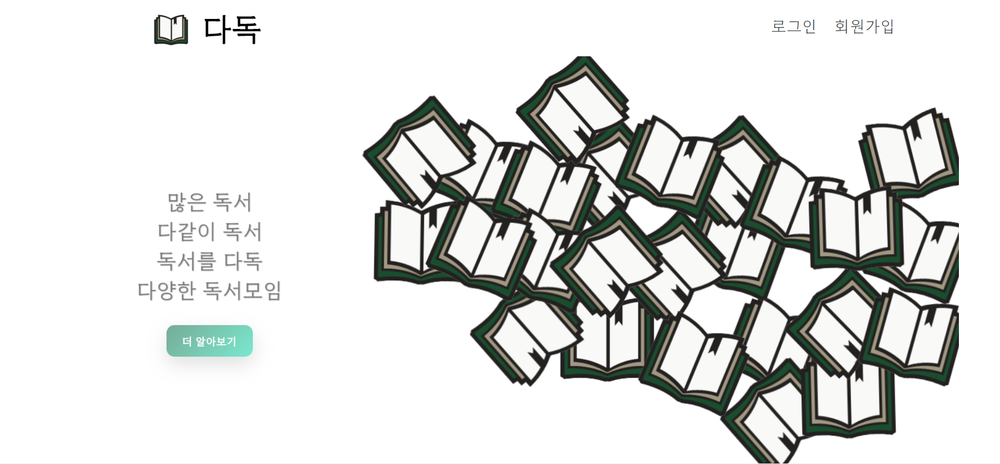
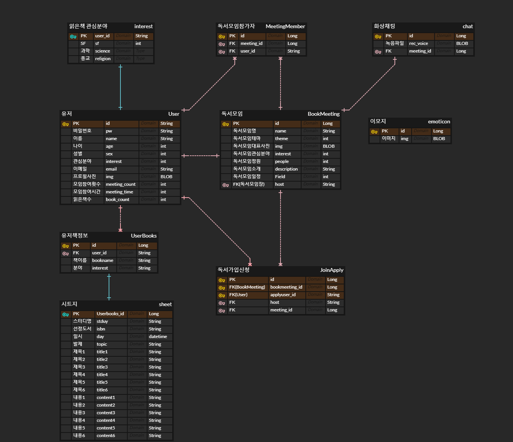
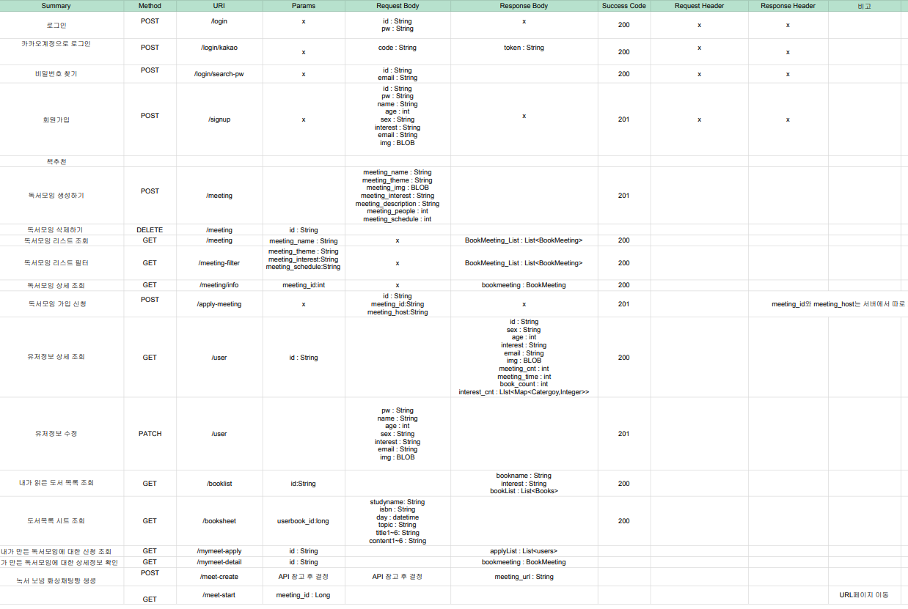

# 다독

## 요약

- WebRTC를 활용한 독서모임 지원과 나의 서재 자동 정리 기능

## 역할

- 프로젝트 전체 인원 5명
- 나의 역할과 기여도
  - 프론트 3명 : 33 %

## 시기

- 프로젝트 진행 기간
  - 2022.06 - 2022.07 (6주)

# 나의 개발

------

- Vuejs 로 프론트엔드 개발
- 유저 / 비유저의 유효성 검사후 페이지 이동 (나중에 백으로 전환)
- Matterjs이용하여 책이 떨어지는 모션 개발
- 모든 프론트 데이터 VueX lifeCycle을 활용하여 개발
- 다양한 이미지를 연출하며 데이터 바인딩을 위한 컴포넌트 구조화

# 미리보기

[메인페이지](https://file.notion.so/f/s/fa52fca9-b2ee-4160-916e-68ecdd20fbb1/%EB%8B%A4%EB%8F%852.mp4?id=2363e300-8fb1-4455-8aa2-c3fe54d5eff2&table=block&spaceId=d9cb09e1-aee8-436e-9b77-3ca7597c732c&expirationTimestamp=1680112917765&signature=hVrzuj7cflLCPxPVtJ-7fWu9aY_AbXgqZf9iQQzhiKE&downloadName=%EB%8B%A4%EB%8F%852.mp4)

------

[마이페이지](https://file.notion.so/f/s/bb3297bb-7d46-443f-b69e-c46125ac03c3/%EB%8B%A4%EB%8F%85%EC%B1%85.mp4?id=0780c50f-e5ce-47a6-9bb7-a1fb4015ff7c&table=block&spaceId=d9cb09e1-aee8-436e-9b77-3ca7597c732c&expirationTimestamp=1680112951763&signature=JT2h7jH2xchO8aahbOPtzemChnaYFr8WS6UnZqKTO2Q&downloadName=%EB%8B%A4%EB%8F%85%EC%B1%85.mp4)

# 다독이란?

## 많은 독서, 다같이 독서, 독서를 다독, 다양한 독서모임

## - 이제 우린 多독 -

## 기능 명세

## 1. 회원관리

### 1.1 로그인

- 1.1.1 로그인 폼 : 아이디, 비밀번호 입력
- 1.1.2 소셜 계정을 이용한 로그인
  - 인증되지 않은 소셜 계정일 경우 (1.2.3) 소셜 계정을 이용한 회원가입으로 이동
- 1.1.3 아이디와 비밀번호가 일치하지 않을 경우 잘못 되었다는 메세지 표시

### 1.2 회원가입

- 1.2.1 회원가입 폼 : 아이디, 비밀번호, 나이, 성별, 관심 분야, 이메일
  - 관심분야 : 인문학, 소설, SF, 과학, 경제, 학습등
  - 유효성 검사 : 아이디, 비밀번호, 이메일 양식에 대한 유효성 검사
  - 가입시 이메일 인증
- 1.2.2 비밀번호 찾기
  - 이메일 인증을 통한 비밀번호 찾기

### 1.3 마이페이지

- 1.3.1 본인 정보 확인 및 수정
  - 아이디, 비밀번호, 나이, 성별, 관심분야, 이메일
  - 가입한 스터디 리스트
  - 아이디를 제외한 정보 수정 가능
  - 정보 수정 시 입력 폼에 대한 유효성 검사

## 2.독서 모임 생성/가입/조회 기능

### 2.1 독서 모임 생성

- 모든 유저는 독서 모임을 생성 가능
  - 모임의 관심분야
  - 제한 인원
  - 기간 및 일정
  - 모임별 고유 코드 및 링크 생성
- 독서 모임의 생성자는 해당 독서 모임에 대한 가입 신청을 받을 수 있고 승인/거절 할 수 있다.
- 독서 모임의 생성자는 원할 때 해당 독서 모임을 지울 수 있다.

### 2.2 독서 모임 조회

- 모든 유저는 자신이 원하는 조건에 맞는 독서 모임을 조회할 수 있다.
  - 관심분야/인원/기간 및 일정 등을 검색조건으로 하여 원하는 독서 모임 조회
- 독서 모임 가입 신청 및 승인 후에는 개별 유저의 독서 모임 관리 페이지에서 가입된 독서 목록들을 확인 할 수 있다.

### 2.3 독서 모임 가입

- 조회된 독서 모임에 결과에 대해 가입 신청을 할 수 있다.

## 3. 독서모임 진행

### 3.1 화상 채팅

- 3.1.1 참가자들의 CAM 화면과 음성을 통한 화상채팅
- 3.1.2 음성 조절 기능
- 3.1.3 CAM ON/OFF 기능
- 3.1.4 투표 기능
- 3.1.5 랜덤 추천 기능

### 3.2 시트지 공유

- 3.2.1 모임 시작 전 :
  - 시트지 템플릿 선택 가능(ex. 토론, 회의, 빈 시트지 등등)
  - 모든 멤버들에 의해  가장 큰 주제 선정
  - 모든 멤버들은 시작 전 템플릿에 따라 감상, 질문등 작성 가능
- 3.2.2 모임 시작 후 :
  - 사전에 작성된 시트지는 모든 참가자들에게 공유화면으로 보입니다.
  - 진행자(권한이 허가된 사람)는 시트지에 질문, 토픽, 주제 등록 가능

### 3.3 회의 진행 기능

- 3.3.1 진행자 권한
  - 참가자에게 음소거할 수 있다.
- 3.3.2 각 참가자는 의견에 대한 이해도를 표시할 수 있는 이모지를 표시할 수 있습니다
  - 나쁜 의견이예요(🥱)
  - 잘 모르겠어요(😥)
  - 그저 그래요(😐)
  - 좋은 의견인것 같아요(😊)♬
  - 사랑해요(🥰)

### ERD

### 페이지 명세서

## 시나리오

[사용자 흐름 보러가기](https://quilled-chess-458.notion.site/ff76e6e2aed24c0ebec6dec4568666cc)

## 기술스택

* Backend 
  * java
  * springboot
  * gradle
  * jpa
  
* Frontend
  * javascript
  * html
  * css
  * Vue.js
  * matter.js
  
* Socket
  * openvidu library
  
* ci/cd
  * Nginx
  * jenkins
  * ec2
  
* Database 
  
  * MYSQL
  
* Cooperation
  * Git
  * Jira
  * Mattermost

  
